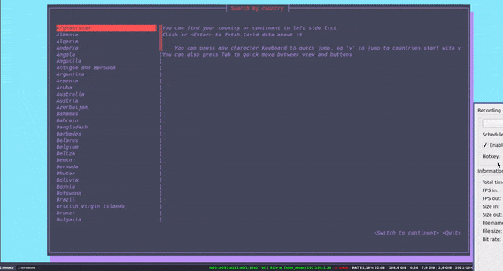

## My first attemp to write something useful in Rust




### Install
```shell
cargo install ncov-cli
```

### How to use
You can find your country or continent in left side list
Click or <Enter> to fetch Covid data about it
You can press any character keyboard to quick jump, eg \'v\' to jump to countries start with v
You can also press Tab to quick move between view and buttons


```shell
cargo run .
```